# Agenda 
Una aplicación multiplataforma desarrollada en **Flutter** para la gestión personal y académica. Permite a los usuarios administrar sus tareas, horarios de clases y ver eventos en un calendario. El proyecto está diseñado con un enfoque responsivo y modular, asegurando escalabilidad y facilidad de mantenimiento.

---

## Arquitectura

El proyecto utiliza una arquitectura **Feature-First** (Orientada a Funcionalidades). Dentro de cada funcionalidad, se aplican principios de **Clean Architecture**, dividiendo el código en capas de datos, dominio y presentación.

### Estructura de Carpetas

La carpeta principal `lib/` está organizada de la siguiente manera:

```text
lib/
├── main.dart                 # Punto de entrada de la aplicación
├── firebase_options.dart     # Configuración generada para Firebase
├── core/                     # Código transversal compartido en toda la app
│   ├── db/                   # Configuración de SQLite (database_helper.dart)
│   ├── theme/                # Temas visuales (app_theme.dart)
│   ├── utils/                # Utilidades, como responsive_layout.dart
│   └── widgets/              # Componentes UI reutilizables (card_list, desktop_columns)
└── features/                 # Módulos de la aplicación
    ├── auth/                 # Autenticación de usuarios
    ├── calendario/           # Vista y gestión de eventos
    ├── configuracion/        # Ajustes generales y de notificaciones
    ├── horario/              # Gestión de clases semanales
    ├── navegacion/           # Sistema de enrutamiento y menús base
    └── tareas/               # Gestión, progreso y creación de tareas
```

### Anatomía de una "Feature"

Cada módulo dentro de `features/` sigue esta estructura (ejemplo con `tareas`):
* **`domain/`**: Modelos de datos puros y reglas de negocio (ej. `tarea.dart`).
* **`data/`**: Fuentes de datos, servicios externos (APIs, Firebase) o DAOs.
* **`repository/`**: Interfaces e implementaciones que conectan `data` con la lógica de estado.
* **`presentation/`**: Toda la interfaz de usuario.
    * **Diseño Responsivo:** Se utilizan archivos separados como `desktop.dart` y `mobile.dart` gestionados por el `responsive_layout.dart` del core para adaptar la vista al tamaño de pantalla.

---

## Diagrama de Clases (UML)

A continuación, se detalla la arquitectura de las clases, repositorios y controladores que dan vida a la lógica de la aplicación:

```mermaid
classDiagram
    %% ================= CORE =================
    class DatabaseHelper {
      -Database? _db
      +Future~Database~ initDB()
      +Future~void~ closeDB()
    }

    class PreferencesHelper {
      -SharedPreferences _prefs
      +Future~void~ init()
      +Duration getGlobalClaseNotificacion()
      +List~Duration~ getGlobalTareaNotificaciones()
      +Future~void~ setGlobalClaseNotificacion(Duration d)
      +Future~void~ setGlobalTareaNotificaciones(List~Duration~ ds)
    }

    class NotificationScheduler {
      -FlutterLocalNotificationsPlugin _plugin
      +Future~void~ init()
      +Future~void~ scheduleNotification(String id, DateTime when, String title, String body)
      +Future~void~ cancelNotification(String id)
      +Future~void~ cancelNotificationsForRange(DateTime start, DateTime end)
    }

    class AppTheme {
      +ThemeData lightTheme
      +ThemeData darkTheme
    }

    class Utils {
      +String formatDate(DateTime fecha)
      +bool validarTexto(String texto)
      +DateTime nextOccurrenceWeekly(DateTime base, int weekday)
    }

    %% ================= FEATURE: TAREAS =================
    class Tarea {
      +String id
      +String titulo
      +String asignatura
      +String descripcion
      +DateTime fecha
      +bool completada
    }

    class Notificacion {
      +String id
      +String tareaId
      +Duration tiempoAntes
      +String mensaje
      +bool activo
    }

    class TareaDao {
      -DatabaseHelper dbHelper
    }

    class NotificacionDao {
      -DatabaseHelper dbHelper
    }

    class TareaService {
      -String baseUrl
    }

    class TareaRepository {
      <<interface>>
      +Future~List~Tarea~~ fetchTareas()
      +Future~void~ addTarea(Tarea tarea)
      +Future~void~ updateTarea(Tarea tarea)
      +Future~void~ deleteTarea(String id)
      +Future~void~ programarNotificacionesTarea(String tareaId)
    }

    class TareaRepositoryImpl {
      -TareaDao tareaDao
      -NotificacionDao notifDao
      -TareaService tareaService
      -PreferencesHelper prefs
      -NotificationScheduler scheduler
    }

    class TasksController {
      -TareaRepository repository
      +List~Tarea~ tareas
      +bool isLoading
      +Future~void~ loadTareas()
      +Future~void~ createTarea(Tarea tarea)
    }

    class TasksPage {
      -TasksController controller
      +Widget build(BuildContext context)
    }

    %% ================= FEATURE: HORARIO =================
    class Clase {
      +String id
      +String materia
      +TimeOfDay inicio
      +TimeOfDay fin
      +String aula
      +bool recurrenteSemanal
    }

    class NotificacionClase {
      +String id
      +String claseId
      +Duration tiempoAntes
      +bool activo
    }

    class ClaseDao {
      -DatabaseHelper dbHelper
    }

    class NotificacionClaseDao {
      -DatabaseHelper dbHelper
    }

    class ClaseRepository {
      <<interface>>
      +Future~List~Clase~~ fetchClases()
      +Future~void~ addClase(Clase clase)
    }

    class ClaseRepositoryImpl {
      -ClaseDao claseDao
      -NotificacionClaseDao notifDao
      -DiasSinClaseDao diasSinClaseDao
      -PreferencesHelper prefs
      -NotificationScheduler scheduler
    }

    class ScheduleController {
      -ClaseRepository repository
      +List~Clase~ clases
      +bool isLoading
      +Future~void~ loadClases()
      +Future~void~ createClase(Clase clase)
    }

    class SchedulePage {
      -ScheduleController controller
      -KalenderController kalenderController
      +Widget build(BuildContext context)
    }

    %% ================= FEATURE: CALENDARIO =================
    class Evento {
      +String id
      +String titulo
      +DateTime fechaInicio
      +DateTime fechaFin
    }

    class DiaSinClase {
      +String id
      +DateTime fechaInicio
      +DateTime fechaFin
      +String motivo
    }

    class EventoDao {
      -DatabaseHelper dbHelper
    }

    class DiasSinClaseDao {
      -DatabaseHelper dbHelper
    }

    class EventoRepository {
      <<interface>>
      +Future~List~Evento~~ fetchEventos()
      +Future~void~ addEvento(Evento evento)
      +Future~List~DiaSinClase~~ fetchDiasSinClase()
      +Future~void~ addDiaSinClase(DiaSinClase dia)
    }

    class EventoRepositoryImpl {
      -EventoDao eventoDao
      -DiasSinClaseDao diasDao
    }

    class CalendarController {
      -EventoRepository repository
      +List~Evento~ eventos
      +List~DiaSinClase~ diasSinClase
      +bool isLoading
      +Future~void~ loadCalendarData()
    }

    class CalendarPage {
      -CalendarController controller
      -KalenderController kalenderController
      +Widget build(BuildContext context)
    }

    %% ================= FEATURE: CONFIGURACION =================
    class SettingsController {
      -PreferencesHelper prefs
      -ClaseRepository claseRepo
      -TareaRepository tareaRepo
      +Duration globalClaseNotif
      +List~Duration~ globalTareaNotifs
      +Future~void~ loadSettings()
      +Future~void~ updateGlobalClaseNotif(Duration d)
      +Future~void~ updateGlobalTareaNotifs(List~Duration~ ds)
    }

    class SettingsPage {
      -SettingsController controller
      +Widget build(BuildContext context)
    }

    class NotificacionConfigWidget {
      -SettingsController controller
      +Widget build()
    }

    %% ================= FEATURE: NAVEGACION =================
    class AppNavigation {
      -int _currentIndex
      -List~Widget~ _pages
      +Widget build(BuildContext context)
    }

    %% ================= RELACIONES =================
    %% DAOs y DB
    TareaDao *-- DatabaseHelper
    NotificacionDao *-- DatabaseHelper
    ClaseDao *-- DatabaseHelper
    NotificacionClaseDao *-- DatabaseHelper
    EventoDao *-- DatabaseHelper
    DiasSinClaseDao *-- DatabaseHelper

    %% Tareas
    TareaRepositoryImpl ..|> TareaRepository
    TareaRepositoryImpl *-- TareaDao
    TareaRepositoryImpl *-- NotificacionDao
    TareaRepositoryImpl *-- TareaService
    TareaRepositoryImpl o-- PreferencesHelper
    TareaRepositoryImpl o-- NotificationScheduler
    TasksController o-- TareaRepository
    TasksPage o-- TasksController

    %% Horario
    ClaseRepositoryImpl ..|> ClaseRepository
    ClaseRepositoryImpl *-- ClaseDao
    ClaseRepositoryImpl *-- NotificacionClaseDao
    ClaseRepositoryImpl *-- DiasSinClaseDao
    ClaseRepositoryImpl o-- PreferencesHelper
    ClaseRepositoryImpl o-- NotificationScheduler
    ScheduleController o-- ClaseRepository
    SchedulePage o-- ScheduleController

    %% Calendario
    EventoRepositoryImpl ..|> EventoRepository
    EventoRepositoryImpl *-- EventoDao
    EventoRepositoryImpl *-- DiasSinClaseDao
    CalendarController o-- EventoRepository
    CalendarPage o-- CalendarController

    %% Configuración
    SettingsController o-- PreferencesHelper
    SettingsController o-- ClaseRepository
    SettingsController o-- TareaRepository
    SettingsPage o-- SettingsController
    NotificacionConfigWidget o-- SettingsController
    SettingsPage *-- NotificacionConfigWidget

    %% Navegación
    AppNavigation *-- TasksPage
    AppNavigation *-- SchedulePage
    AppNavigation *-- CalendarPage
    AppNavigation *-- SettingsPage
```



---

## Tecnologías y Librerías Principales
* **[Flutter](https://flutter.dev/):** SDK para el desarrollo multiplataforma.
* **[Dart](https://dart.dev/):** Lenguaje de programación.
* **SQLite / `sqflite`:** Para el almacenamiento persistente y sin conexión.
* **Firebase:** Servicios de backend en la nube (Core y Auth integrados).
* **Flutter Local Notifications:** Para el sistema inteligente de alarmas y recordatorios.

---

## Cómo Empezar

Sigue estos pasos para ejecutar el proyecto en tu máquina local:

1. Clona el repositorio:
   ```bash
   git clone https://github.com/RuedaUABC/agenda.git
   ```
2. Instala las dependencias:
   ```bash
   flutter pub get
   ```
3. Ejecuta la aplicación (asegúrate de tener un emulador abierto o un dispositivo físico conectado):
   ```bash
   flutter run
   ```

*Nota: Para que la autenticación de Firebase funcione correctamente, asegúrate de tener configurado tu archivo de entorno y los parámetros en tu consola de Firebase.*
```