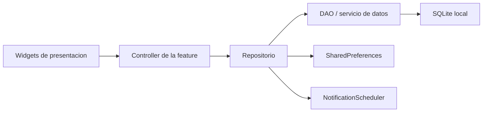

# Arquitectura

Agenda usa una organizacion feature-first: el codigo se agrupa primero por
funcionalidad y, dentro de cada feature, se separa en capas de dominio, datos,
repositorio y presentacion cuando aplica.

## Estructura General

```text
lib/
|-- main.dart
|-- firebase_options.dart
|-- core/
|   |-- db/
|   |-- theme/
|   |-- utils/
|   `-- widgets/
`-- features/
    |-- auth/
    |-- calendario/
    |-- configuracion/
    |-- horario/
    |-- navegacion/
    `-- tareas/
```

## Punto de Entrada

`lib/main.dart` prepara los bindings de Flutter, configura `sqflite_common_ffi`
en Windows y Linux, y monta `MyApp`.

`MyApp` usa:

- `AppTheme.darkTheme` como tema principal.
- `ThemeMode.dark` para forzar modo oscuro.
- `nav` como widget raiz de navegacion.

La guia objetivo de interfaz esta documentada en
[`diseno_material3.md`](diseno_material3.md). El rediseno planificado migra el
tema hacia Material 3 completo, con `ThemeMode.system`, tema claro/oscuro,
`ColorScheme.fromSeed` y navegacion adaptativa con `NavigationBar` y
`NavigationRail`.

La inicializacion de Firebase esta presente como comentario. Esto significa que
las opciones generadas existen en el repositorio, pero Firebase no se inicializa
actualmente al arrancar la aplicacion.

## Core

`core/` contiene piezas compartidas por varias features.

- `core/db/database_helper.dart`: crea y migra la base local `agenda.db`.
- `core/theme/app_theme.dart`: define el tema visual de la aplicacion.
- `core/utils/`: utilidades transversales, incluyendo layout responsivo y
  programacion de notificaciones.
- `core/widgets/`: componentes reutilizables de interfaz.

Los componentes visuales compartidos deben alinearse con Material 3 y, cuando
se implementen, priorizar widgets nativos de Flutter antes que paquetes
externos de apariencia.

## Persistencia Local

La base SQLite se administra con `DatabaseHelper`. La version actual de la base
es `3` y crea estas tablas:

- `tareas`
- `clases`
- `eventos`

En escritorio, `main.dart` inicializa `sqflite_common_ffi` para que SQLite pueda
funcionar en Windows y Linux.

## Features

### Tareas

Ruta principal: `lib/features/tareas/`.

Responsabilidades:

- Crear, actualizar y eliminar tareas.
- Mantener una papelera de tareas eliminadas.
- Restaurar tareas desde papelera.
- Clasificar tareas por vencidas, pendientes de la semana, proximas y
  completadas.
- Calcular estadisticas semanales y progreso diario.
- Programar recordatorios segun preferencias globales.

Piezas principales:

- `domain/tarea.dart`: modelo de tarea.
- `domain/notificacion.dart`: modelo de notificacion.
- `data/tarea_dao.dart`: acceso SQLite para tareas.
- `data/notificacion_dao.dart`: acceso SQLite para notificaciones.
- `repository/tarea_repository.dart`: contrato del repositorio.
- `repository/tareas_repository_impt.dart`: implementacion del repositorio.
- `presentation/taskcontroller.dart`: estado y operaciones de la pantalla.
- `presentation/tareas.dart`, `mobile.dart`, `desktop.dart`: UI responsiva.

### Horario

Ruta principal: `lib/features/horario/`.

Responsabilidades:

- Administrar clases.
- Mostrar clases en calendario.
- Soportar recurrencias semanales.
- Normalizar reglas de recurrencia antiguas que no incluyen `BYDAY`.

Piezas principales:

- `domain/clase.dart`: modelo de clase.
- `data/clase_dao.dart`: acceso SQLite.
- `repository/horario_repository.dart`: contrato del repositorio.
- `repository/horario_repository_impl.dart`: implementacion.
- `presentation/horario_controller.dart`: estado y adaptador hacia
  `syncfusion_flutter_calendar`.
- `presentation/mobile.dart`: vista mobile con selector segmentado `Semana` /
  `Dia`.
- `presentation/desktop.dart`: vista desktop con calendario semanal y panel
  lateral del dia seleccionado.
- `presentation/widgets/`: formulario, tarjetas de clase y panel diario
  reutilizable.

### Calendario

Ruta principal: `lib/features/calendario/`.

Responsabilidades:

- Administrar eventos.
- Mantener fecha seleccionada.
- Convertir eventos del dominio a `Appointment` de Syncfusion.
- Validar creacion y edicion de eventos antes de persistir.
- Confirmar eliminaciones destructivas desde la interfaz.

Piezas principales:

- `domain/evento.dart`: modelo de evento.
- `domain/evento_validator.dart`: reglas de validacion y normalizacion.
- `data/evento_dao.dart`: acceso SQLite.
- `repository/calendario_repository.dart`: contrato.
- `repository/calendario_repository_impl.dart`: implementacion.
- `presentation/calendario_controller.dart`: estado y `EventoDataSource`.
- `presentation/mobile.dart`: vista mobile con selector segmentado `Mes` /
  `Dia`.
- `presentation/desktop.dart`: vista desktop con calendario mensual y panel
  lateral del dia seleccionado.
- `presentation/widgets/`: formulario, tarjetas de evento y panel diario
  reutilizable.

### Configuracion

Ruta principal: `lib/features/configuracion/`.

Responsabilidades:

- Leer y guardar preferencias globales.
- Configurar anticipacion de avisos para clases y tareas.
- Reprogramar notificaciones de tareas pendientes cuando cambian las
  preferencias.

Piezas principales:

- `preferences_helper.dart`: acceso a `shared_preferences`.
- `presentation/settings_controller.dart`: estado de configuracion.
- `presentation/notificacion_config_widget.dart`: controles de avisos.
- `presentation/settings.dart`, `mobile.dart`, `desktop.dart`: UI.

### Navegacion

Ruta principal: `lib/features/navegacion/`.

`presentation/navegacion.dart` contiene `AgendaNavigation`, que usa
`NavigationBar` en movil, `NavigationRail` en pantallas medianas o grandes e
`IndexedStack` para alternar entre:

- Tareas
- Horario
- Calendario
- Ajustes

### Auth

Ruta principal: `lib/features/auth/`.

Contiene la pantalla y servicio de autenticacion. La dependencia de Firebase
Auth existe en `pubspec.yaml`, pero Firebase no se inicializa actualmente desde
`main.dart`.

## Flujo de Datos



## Reglas Practicas

- Agregar modelos en `domain/` cuando representen entidades del negocio.
- Mantener acceso a SQLite dentro de `data/`.
- Exponer operaciones a la UI mediante repositorios y controllers.
- Crear vistas `mobile.dart` y `desktop.dart` cuando la experiencia cambia por
  tamano de pantalla.
- Mantener los tests junto a la feature correspondiente en `test/features/`.
